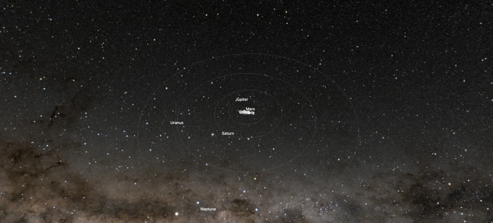

# Solar System

A solar system web application.



## Run

```bash
bun install
bun dev
```

## Next

- add the moon
- add the planet eris
- add the planet ceres
- add the planet pluto

## License

[MIT](LICENSE) © Igor Morais
